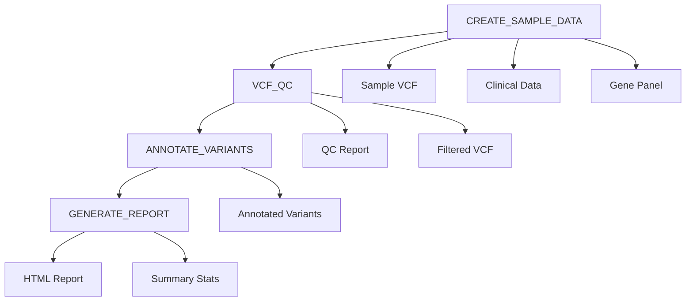

# Oncology Genomics Pipeline with Nextflow and Nextfuse

A comprehensive Nextflow pipeline for processing oncology genomics data using the Nextfuse plugin for Domino Data Lab execution.

## 🧬 Overview

This pipeline demonstrates precision oncology genomics analysis by processing variant call format (VCF) files and clinical data to identify cancer-relevant genetic mutations. The pipeline is designed to run on Domino Data Lab infrastructure using the Nextfuse plugin for seamless execution and monitoring.

### What This Pipeline Does

- **Quality Control**: Filters genetic variants based on coverage and allele frequency
- **Gene Annotation**: Maps variants to oncology-relevant genes (BRAF, TP53, PIK3CA, BRCA2)
- **Clinical Integration**: Combines genetic findings with patient clinical data
- **Report Generation**: Creates comprehensive HTML reports for clinical review

## 🎯 Target Audience

- **Bioinformaticians** working in cancer genomics
- **Clinical researchers** studying precision oncology
- **Data scientists** in healthcare and genomics
- **Nextflow users** looking for Domino integration examples

## 🔬 Scientific Background

### Oncology Genomics Fundamentals

**Precision oncology** uses genetic information from tumors to guide treatment decisions. This pipeline focuses on four critical cancer genes:

| Gene | Function | Cancer Relevance |
|------|----------|------------------|
| **BRAF** | Cell growth control | Melanoma, colorectal cancer; targetable with BRAF inhibitors |
| **TP53** | DNA damage response | Mutated in ~50% of cancers; "guardian of the genome" |
| **PIK3CA** | Cell survival/growth | Breast, colorectal cancer; targetable with PI3K inhibitors |
| **BRCA2** | DNA repair | Hereditary breast/ovarian cancer; PARP inhibitor sensitivity |

### Clinical Impact

When oncologists receive this analysis, they can:
- Select targeted therapies based on specific mutations
- Predict treatment response and resistance
- Assess hereditary cancer risk
- Make informed prognosis decisions

## 🚀 Quick Start

### Prerequisites

- make sure data, results and work directories exist in the project datasets.  ex: 

Domino File System Based Projects

  - work : /domino/datasets/local/<domino project name>/work
  - data: /domino/datasets/local/<domino project name>/oncology_data 
  - results: /domino/datasets/local/<domino project name>/oncology_results

Git based Projects
  - work : /mnt/data/<domino project name>/work
  - data: /mnt/data/<domino project name>/oncology_data 
  - results: /mnt/data/<domino project name>/oncology_results

  ```
  mkdir -p /mnt/data/$DOMINO_PROJECT_NAME/work
  ```

- make sure to update the netflow configs to specify correct hardware tier of your Domino.

- make sure to update the netflow configs specify the correct compute enviornment in imageMap mapping.
Ex:  
```
'ubuntu:20.04':'Domino Standard Environment Py3.10 R4.5'
```
ubuntu:20.04 used in the Nextflow pipeline is mapped to a local Domino compute Environment Domino Standard Environment Py3.10 R4.5.

- Domino Data Lab Compute environment with Nextfuse plugin

Note: You will need KSM partner's Nextfuse repo user and password as well as the plugin version. We are using plugin version 1.1.0

```

ARG NEXTFUSE_REPO_USERNAME
ARG NEXTFUSE_REPO_PASSWORD
ARG NEXTFUSE_REPO_URL_BASE=https://repo.ksmpartners.com/repository/nextfuse
ARG NEXTFUSE_VERSION
ARG NEXTFLOW_VERSION=23.10.1

USER root

# Install Adoptium JDK 17
RUN mkdir -p /opt/java && \
curl -sL "https://github.com/adoptium/temurin17-binaries/releases/download/jdk-17+35/OpenJDK17-jdk_x64_linux_hotspot_17_35.tar.gz" | tar xz -C /opt/java --strip-components=1

# Set JAVA_HOME environment variable
ENV JAVA_HOME /opt/java

# Add JAVA_HOME/bin to the PATH environment variable
ENV PATH $JAVA_HOME/bin:$PATH

# Install Nextflow
RUN curl -sL -o /usr/local/bin/nextflow https://github.com/nextflow-io/nextflow/releases/download/v${NEXTFLOW_VERSION}/nextflow && \
    chmod +x /usr/local/bin/nextflow  && \
    mkdir -p /home/ubuntu/.nextflow/plugins && \
    chown -R ubuntu:ubuntu /home/ubuntu/.nextflow
    
# Install Nextfuse
RUN curl -sL -u "${NEXTFUSE_REPO_USERNAME}:${NEXTFUSE_REPO_PASSWORD}" ${NEXTFUSE_REPO_URL_BASE}/nextfuse-${NEXTFUSE_VERSION}.tar.gz | tar xz -C /home/ubuntu/.nextflow/plugins && \
chown -R ubuntu:ubuntu /home/ubuntu/.nextflow/plugins

# Force download of Nextflow dependencies
USER ubuntu
RUN nextflow -v
    
CMD ["/bin/bash"]
```


### Installation

Create a domino project based off the following repository. you can import this repository to an existing project as well.

https://github.com/ddl-wasanthag/domino-nextflow-example


#### Verify Nextflow installation

Open up a workspace and execute in terminal.
```
nextflow -version

```

##### Check Nextfuse plugin availability

```
nextflow plugin list
```

### Basic Usage

```bash
# Run with default parameters (uses sample data)
nextflow run oncology.nf

# Run with custom parameters
nextflow run main.nf \
  --output_dir /domino/datasets/local/my_results \
  --min_coverage 20 \
  --min_variant_freq 0.1
```

## 📁 Pipeline Structure

```
oncology-genomics-pipeline/
├── main.nf                 # Main pipeline script
├── nextflow.config         # Nextfuse configuration
├── README.md              # This file
├── docs/                  # Additional documentation
│   └── oncology_guide.md  # Detailed oncology concepts
└── examples/              # Example input files
    ├── sample_variants.vcf
    ├── clinical_data.csv
    └── gene_panel.txt
```

## ⚙️ Configuration

### Nextfuse Setup

The pipeline is configured for Domino Data Lab execution:

```groovy
plugins {
  id 'nextfuse@1.1.0'  
}

process {
  executor = 'domino'
  withLabel:process_low {
    ext.hardwareTierName = 'small'
  }
}

domino {
  hardwareTierId = 'small-k8s'
  imageMap = [
    'ubuntu:20.04':'Domino Standard Environment Py3.10 R4.5'
  ]
}
```

### Parameters

| Parameter | Default | Description |
|-----------|---------|-------------|
| `input_dir` | `/domino/datasets/local/oncology_data` | Input data directory |
| `output_dir` | `/domino/datasets/local/nextfuse/oncology_results` | Output directory |
| `min_coverage` | `10` | Minimum sequencing coverage for variants |
| `min_variant_freq` | `0.05` | Minimum allele frequency (5%) |

## 🔄 Pipeline Workflow

### Process Flow



### 1. CREATE_SAMPLE_DATA
- **Purpose**: Generate sample genomic and clinical data
- **Outputs**: VCF file, clinical data CSV, gene panel
- **Real-world equivalent**: Data from tumor sequencing and EHR systems

### 2. VCF_QC (Quality Control)
- **Purpose**: Filter variants by quality metrics
- **Filters**: Minimum coverage (10x) and allele frequency (5%)
- **Outputs**: QC report and filtered variant file

### 3. ANNOTATE_VARIANTS
- **Purpose**: Map variants to cancer genes
- **Method**: Position-based gene annotation
- **Output**: Tab-separated file with gene assignments

### 4. GENERATE_REPORT
- **Purpose**: Create clinical-ready reports
- **Outputs**: HTML report and summary statistics
- **Features**: Integrated genetic and clinical data visualization

## 📊 Output Structure

```
results/
├── input_data/          # Original data files
│   ├── sample_variants.vcf
│   ├── clinical_data.csv
│   └── gene_panel.txt
├── qc/                  # Quality control results
│   ├── qc_report.txt
│   └── filtered_variants.vcf
├── annotation/          # Annotated variants
│   └── annotated_variants.tsv
└── reports/             # Final clinical reports
    ├── oncology_report.html
    └── summary_stats.txt
```

## 🔧 Customization

### Using Real Data

Replace the sample data generation with your own files:

```groovy
// Comment out CREATE_SAMPLE_DATA process
// Add input channels for your data
vcf_ch = Channel.fromPath("${params.input_dir}/*.vcf")
clinical_ch = Channel.fromPath("${params.input_dir}/clinical_data.csv")
```

### Adding More Genes

Extend the gene panel in `CREATE_SAMPLE_DATA`:

```bash
cat > gene_panel.txt << 'EOF'
BRAF
TP53
PIK3CA
BRCA2
EGFR      # Add epidermal growth factor receptor
KRAS      # Add Kirsten rat sarcoma viral oncogene
ALK       # Add anaplastic lymphoma kinase
EOF
```

### Advanced Annotation

For production use, integrate with professional annotation tools:

```groovy
process VEP_ANNOTATION {
    container = 'ensemblorg/ensembl-vep'
    script:
    """
    vep --input_file ${vcf} --output_file annotated.vcf --format vcf
    """
}
```

## 📈 Monitoring and Logging

### Nextfuse Integration

The pipeline integrates with Domino's monitoring through Nextfuse:

- **Job tracking**: Monitor execution in Domino dashboard
- **Resource usage**: Track CPU/memory consumption
- **Error handling**: Automatic retry on transient failures

### Execution Reports

Generate detailed execution reports:

```bash
nextflow run main.nf -with-trace -with-timeline -with-report
```

## 🧪 Testing

### Unit Tests

```bash
# Test individual processes
nextflow run main.nf -entry CREATE_SAMPLE_DATA
nextflow run main.nf -entry VCF_QC --vcf examples/sample_variants.vcf
```

### Integration Tests

```bash
# Full pipeline test with sample data
nextflow run main.nf --output_dir /tmp/test_results
```

**Resource Limits**
```bash
# Adjust hardware tier if jobs are killed
process {
  withLabel:process_low {
    ext.hardwareTierName = 'medium'  # Try larger tier
  }
}
```

### Getting Help

- **Issues**: [GitHub Issues](https://github.com/your-org/oncology-genomics-pipeline/issues)
- **Discussions**: [GitHub Discussions](https://github.com/your-org/oncology-genomics-pipeline/discussions)
- **Nextflow Help**: [Nextflow Documentation](https://www.nextflow.io/docs/latest/)
- **Nextfuse Plugin**: [Nextfuse Documentation](https://github.com/dominodatalab/nextfuse)

## 📖 Citation

If you use this pipeline in your research, please cite:

```bibtex
@software{oncology_genomics_pipeline,
  title={Oncology Genomics Pipeline with Nextflow and Nextfuse},
  author={Your Name},
  year={2025},
  url={https://github.com/your-org/oncology-genomics-pipeline}
}
```

## 🔗 Related Projects

- [nf-core/sarek](https://github.com/nf-core/sarek) - Comprehensive cancer genomics pipeline
- [GATK Best Practices](https://gatk.broadinstitute.org/hc/en-us/sections/360007226651) - Variant calling workflows
- [Nextfuse Plugin](https://github.com/dominodatalab/nextfuse) - Domino integration for Nextflow

---


